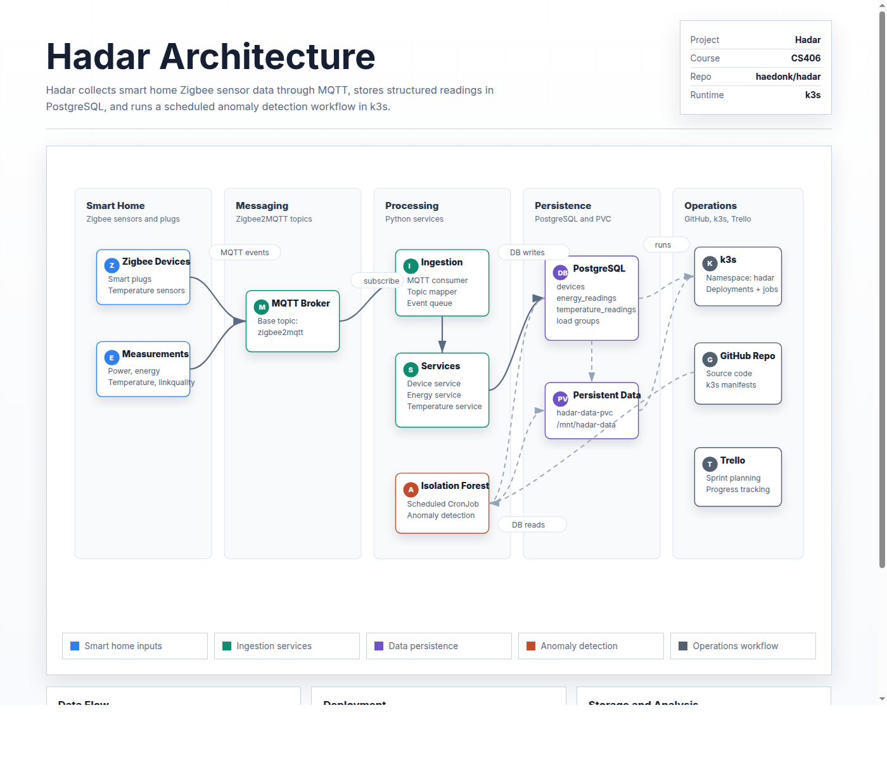

# Hadar

Hadar is a smart-home anomaly monitoring system. It ingests Zigbee/MQTT temperature and energy sensor data into PostgreSQL, runs per-device Isolation Forest anomaly detection on a recurring schedule, and surfaces results through a React dashboard.



## Components

| Directory | Description |
|---|---|
| `api/` | FastAPI backend serving the dashboard REST API |
| `ui/` | Vite + React dashboard SPA (served via nginx in production) |
| `ingestion-pipeline/` | MQTT consumer that writes energy and temperature readings to PostgreSQL |
| `isolation-forest/` | Scheduled model training pipeline (scikit-learn Isolation Forest, per-device) |
| `scoring-pipeline/` | Hourly scoring service that loads promoted models and persists anomaly events |
| `db/` | Shared SQLAlchemy models and async session management (used by all Python services) |
| `k3s/` | Kubernetes manifests for the k3s deployment |
| `docs/` | Architecture diagram source and database schema reference |
| `data/` | Internal planning documents and specs |

## Local Setup

Create a single Python environment at the repository root:

```bash
python -m venv .venv
source .venv/bin/activate
pip install --upgrade pip
pip install -r requirements-dev.txt
pip install -r requirements.txt
```

Each service also has its own `requirements.txt` for Docker builds:

```text
api/requirements.txt
ingestion-pipeline/requirements.txt
isolation-forest/requirements.txt
scoring-pipeline/requirements.txt
```

Copy the example environment files and fill in local values:

```bash
cp ingestion-pipeline/.env.example ingestion-pipeline/.env
cp isolation-forest/.env.example isolation-forest/.env
```

Do not commit `.env` files or real credentials.

## Docker Images

Build from the repository root so the shared `db/` package is included in the context:

```bash
docker build -f api/Dockerfile -t hadar-api .
docker build -f ingestion-pipeline/Dockerfile -t hadar-ingestion-pipeline .
docker build -f isolation-forest/Dockerfile -t hadar-isolation-forest .
docker build -f scoring-pipeline/Dockerfile -t hadar-scoring-pipeline .
docker build -f ui/Dockerfile -t hadar-ui ui
```

Prefer immutable commit-SHA tags over `latest` for production rollouts.

## Deployment

Kubernetes manifests live in `k3s/`. They intentionally exclude real secrets. See [`k3s/README.md`](k3s/README.md) for apply order, required secrets, and verification steps.

## Development

```bash
# Lint
ruff check .

# Type-check shared DB package
mypy db

# Run tests
pytest
```
